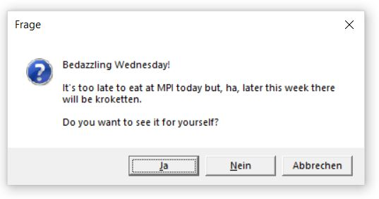

<!-- README.md is generated from README.Rmd. Please edit that file -->

```{r, include = FALSE}
knitr::opts_chunk$set(
  collapse = TRUE,
  comment = "#>",
  fig.path = "man/figures/README-",
  out.width = "60%"
)
library(knitr)
```
# lunch

<!-- badges: start -->
[](https://travis-ci.com/T-Engel/lunch)
<!-- badges: end -->

The goal of the `lunch` package is to keep users informed about the lunch menu at MPI.

## Installation

You can install the development version from [GitHub](https://github.com/) with:

``` r
# install.packages("devtools")
devtools::install_github("T-Engel/lunch")
```
## Example

Here, is how you can check the menu:

```{r example, eval=FALSE}
library(lunch)
whatsforlunch()
```

You'll be prompted with a message commenting on the menu and giving you food alerts.
```{r, echo=FALSE, out.width= "40%"}
 
```


Click Yes to proceed to the website:

```{r, echo= FALSE }
include_graphics("man/figures/README-Example2.JPG") 
```

`lunch` has some sensible default alerts that people generaly like to know about. "Kroketten" like in the example above is surely one of them. Here is the full list of preset alerts:

```{r, echo=FALSE}
cat(lunch:::alerts)
```

## Setting your own alerts

`lunch` also lets you set your own alerts. For example, if you die for kartoffelpüree and aubergine you can tell the package and it will remember. Here is how:

```{r, eval=F}
set_my_lunch_alerts(alerts = c("kartoffelpüree", "aubergine"))
```

This function will generate a string, copy it to your clipboard and ask you to save it in your R.environ file. No worries, it'll also find the file for you if you like. Just click "yes" in the next prompt:

```{r,  echo= FALSE, out.width="40%"}
include_graphics("man/figures/README-Example3.JPG") 
```

This is how your R.environ file might look like. Probably it's empty. But maybe you have some other definitions in there: 
```{r, echo= FALSE, out.width="50%"}
include_graphics("man/figures/README-Example4.JPG") 
```

Just paste the string from your clipboard into the file (ctrl+v), save it (ctrl+s) and restart R (crtl+shift+F10).

```{r, echo= FALSE, out.width="50%"}
include_graphics("man/figures/README-Example5.JPG") 
```

When you now reload `lunch`, it'll remember your food alerts

```{r, eval=FALSE}
library(lunch)
whatsforlunch()
```

```{r, echo= FALSE, out.width="50%"}
include_graphics("man/figures/README-Example6.JPG") 
```

It looks like we're lucky and they do infact have Kartoffelpüree this week. Click "yes" to proceed to the menu.

Enjoy your meal!

