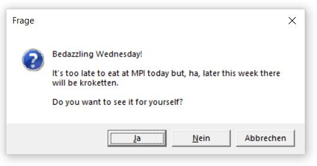
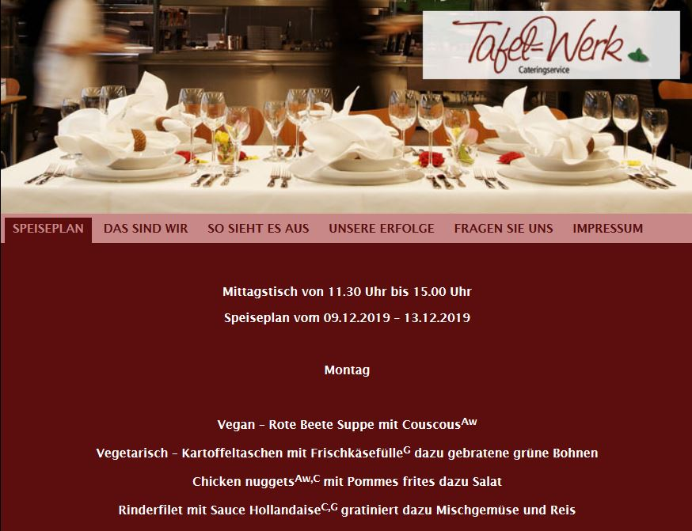

<!-- README.md is generated from README.Rmd. Please edit that file -->

# lunch

<!-- badges: start -->

<!-- badges: end -->

The goal of the lunch package is to keep users informed about the lunch
menu at MPI.

## Installation

You can install the development version from
[GitHub](https://github.com/) with:

``` r
# install.packages("devtools")
devtools::install_github("T-Engel/lunch")
```

## Example

Here is how you can check the menu:

``` r
library(lunch)
whatsforlunch()
```

You’ll be prompted with a message commenting on the menu and giving you
food alerts. 

Click Yes to proceed to the website:


